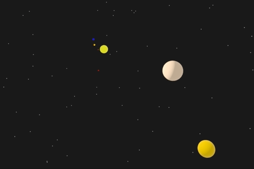

#  bevy-nbody

Experiments with a basic n-body simulation in 3D to checkout [Bevy](https://bevyengine.org/).

In particular, pretty cool ephemerides data from JPL Horizons allowing you to get initial conditions to simulate the Solar System.
Distances between objects are to-scale (`0.1 AU/unit`). Radiuses of planets as well (`10^-4 km/unit`) but not the Sun. Note that therefore radiuses and distances use a different scale.
```
cargo run --release -- --startup solar --speed 10
```


## Usage
```
Usage: nbody [--startup <startup>] [--speed <speed>] [-d]

N-body 3D simulation with Bevy

Several `--startup` options:
* solar: planets of the Solar System - and Pluto :'( - with data from JPL Horizons as-of 2021-04-18.
* figure8: stable figure-8 three-body solution
* random: generates random bodies around a large star

Mouse controls: 
* right-click & drag to orbit the camera 
* scroll to zoom

Options:
  --startup         startup system [solar (default)|figure8|random]
  --speed           speed of the simulation [default: 1.0x]
  -d, --debug       enable diagnostics in the console
  --help            display usage information
```
